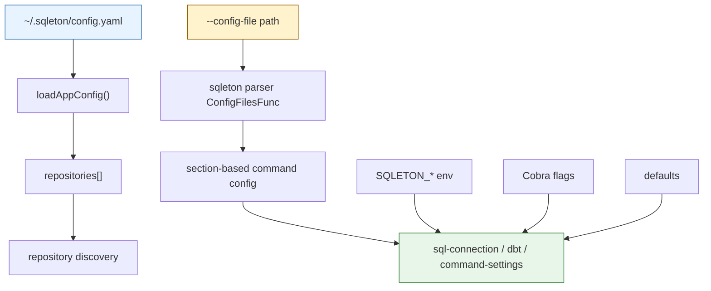

# Sqleton SQL Command Cleanup

This workday turned into a full cleanup of how `sqleton` defines, discovers, parses, and executes SQL-backed commands. It started as an architectural review of the existing SQL command loader, grew into a redesign of the command source format, and ended with a concrete implementation that removed direct Viper usage from sqleton and separated app-level config from command-level config.

> [!summary]
> Three things were accomplished end to end:
> 1. the SQL command loader was simplified around real `.sql` files and explicit `.alias.yaml` files
> 2. the runtime and CLI paths were exercised with real SQLite-backed smoke tests
> 3. sqleton moved off the old Viper-driven startup/config story to an app-owned config model that no longer lets `repositories:` collide with command-section parsing

## Why this work existed

The original sqleton command-loading design had a useful idea at its center: treat SQL as a first-class command definition source. The problem was not the existence of SQL-backed commands. The problem was the layering around them.

The old design spread responsibility across multiple systems:

- `sqleton` knew how to interpret YAML-backed SQL commands
- `glazed` had a generic command-or-alias loader path with fallback parsing
- `clay` repository loading injected commands, aliases, help, and discovery
- `run-command` used a special execution path instead of looking like a normal discovered command

That meant a simple mental question such as "what happens when I point sqleton at a query file?" had no single answer. The truth depended on whether the file was embedded or local, whether it was being discovered through repositories or passed directly to `run-command`, and whether the parser first thought it was a command or an alias.

The cleanup had two goals:

1. make SQL commands feel like normal command definitions rather than an odd side channel
2. make the configuration story explicit enough that a top-level app config file can coexist with command-level parameter config without cross-contaminating each other

## Current project status

The cleanup is implemented, tested, and documented.

What exists now:

- SQL commands are real `.sql` files with a metadata preamble at the top
- aliases are explicit `.alias.yaml` files
- sqleton compiles parsed SQL command specs through a clearer intermediate representation
- optional boolean SQL flags default to `false`
- `run-command` still requires `--` before forwarded command flags, but now uses the normal Cobra path instead of a hidden fast path
- repository discovery has smoke coverage through:
  - `SQLETON_REPOSITORIES`
  - `~/.sqleton/config.yaml`
- direct Viper usage has been removed from sqleton code under `sqleton/cmd/sqleton` and `sqleton/pkg`

What remains open:

- there is still room to simplify and unify command/config bootstrapping patterns across related apps
- the current follow-up opportunity is more about consistency and ergonomics than correctness

## Project shape

This workspace is not one monolithic repo. It is a coordinated multi-repo change set:

- `/home/manuel/workspaces/2026-04-02/add-sql-based-sql-commands/sqleton`
  - the main implementation target
- `/home/manuel/workspaces/2026-04-02/add-sql-based-sql-commands/clay`
  - repository loading, ticket docs, and shared SQL/config infrastructure
- `/home/manuel/workspaces/2026-04-02/add-sql-based-sql-commands/glazed`
  - command parsing, Cobra integration, config-file middleware
- `/home/manuel/workspaces/2026-04-02/add-sql-based-sql-commands/go-go-goja`
  - research context for metadata/doc-generation ideas through `jsverbs`

The two most important code areas in sqleton are:

- `/home/manuel/workspaces/2026-04-02/add-sql-based-sql-commands/sqleton/pkg/cmds`
- `/home/manuel/workspaces/2026-04-02/add-sql-based-sql-commands/sqleton/cmd/sqleton`

The two most important documentation outputs from the work are:

- `/home/manuel/workspaces/2026-04-02/add-sql-based-sql-commands/clay/ttmp/2026/04/02/SQLETON-01-SQL-COMMAND-LOADER-REVIEW--review-sqleton-sql-command-loading-and-design-sql-file-preambles`
- `/home/manuel/workspaces/2026-04-02/add-sql-based-sql-commands/clay/ttmp/2026/04/02/SQLETON-02-VIPER-APP-CONFIG-CLEANUP--remove-viper-and-separate-sqleton-app-config-from-command-config`

## Architecture before the cleanup

The original command-loading story had a few specific pathologies.

### 1. Command-vs-alias detection was implicit

The generic loader path effectively did this:

```text
read file
-> try parse as command
-> if that errors, try parse as alias
-> if alias parse works, accept alias
```

That is mechanically convenient, but it means a malformed command file can accidentally travel down the alias path. That weakens both clarity and error reporting.

### 2. YAML was carrying the SQL body

SQL commands were defined through YAML structures whose `query` field contained the SQL text. That works, but it is not a good home for the main artifact. The most important thing in the file is the SQL itself, so the file should primarily be SQL.

### 3. App config and command config shared one interpretation path

The same `~/.sqleton/config.yaml` file was being used for two conceptually different jobs:

- app-level repository discovery via `repositories:`
- section-based command parameter loading for things like `sql-connection` and `dbt`

That broke down because Glazed expects command config files to look like section maps:

```yaml
sql-connection:
  db-type: sqlite
  database: ./foo.db
```

but sqleton also needed app-level config like:

```yaml
repositories:
  - /path/to/repo
```

The first is command config. The second is app config. Sharing the same parsing expectation made the system fragile.

## What changed today

The implementation moved in four phases.

### Phase 1. SQL command format cleanup

The command-loader cleanup introduced a neutral `SqlCommandSpec` stage and made source kinds explicit:

- commands: `.sql`
- aliases: `.alias.yaml`
- no `aliases/` directory convention required
- no legacy YAML wrappers or backward-compatibility layer

This is the key conceptual cleanup: a source file now has a deterministic identity before parsing.

### Phase 2. Runtime path cleanup and smoke coverage

The CLI was tested against a real temporary SQLite database instead of only relying on unit tests or parser assumptions.

That smoke coverage now proves:

- raw `sqleton query` works against SQLite
- `sqleton run-command` works against a real `.sql` command file
- discovered repository commands work
- discovered aliases work
- repository discovery works through config and environment sources

### Phase 3. Viper removal from startup

Sqleton now owns repository discovery through direct YAML decoding and explicit environment merging instead of reading repository paths through Viper globals.

### Phase 4. Parser/config separation

Sqleton now uses an app-owned parser config that keeps:

- `SQLETON_*` environment loading

but changes config-file behavior to:

- load command config only from explicit `--config-file`

That is the design pivot that finally separates app config from command config.

## Implementation details

The easiest way to understand the finished design is to think in terms of two distinct pipelines.

### Pipeline 1: SQL command source to executable command

```mermaid
flowchart LR
    A[".sql file"] --> B["split metadata preamble"]
    B --> C["decode YAML metadata"]
    C --> D["SqlCommandSpec"]
    D --> E["validate spec"]
    E --> F["compile to SqlCommand"]
    F --> G["Cobra command"]
    G --> H["render SQL template"]
    H --> I["execute against DB"]

    style A fill:#e7f3ff,stroke:#3572b0
    style D fill:#fff3cd,stroke:#946200
    style F fill:#e8f5e9,stroke:#2e7d32
    style I fill:#fdecea,stroke:#b3261e
```



The important abstraction is `SqlCommandSpec`. It is the point where source-format details stop mattering.

Before that point, sqleton is doing source parsing:

- reading a file
- separating preamble from SQL body
- decoding metadata
- deciding whether a file is a command or an alias

After that point, sqleton is doing command compilation:

- validating fields
- injecting defaults such as `false` for optional bool flags
- constructing the actual runtime `SqlCommand`

That gives the system a clean seam. If a future source format exists, it should still compile through `SqlCommandSpec`.

#### SQL command preamble shape

The new `.sql` source format looks like this conceptually:

```sql
/*
name: smoke-widgets
short: List widgets
flags:
  - name: only_active
    type: bool
*/

SELECT id, name
FROM widgets
WHERE active = 1 OR NOT {{ .only_active }}
ORDER BY id;
```

This is a better fit than putting SQL inside a YAML string because:

- the body is valid SQL text
- metadata is still machine-readable
- humans can open the file and immediately see the actual query

### Pipeline 2: App config and command config



This split is the most important architectural result of the day.

The rule is now:

- app config is for the application itself
- command config is for command sections

That sounds obvious, but the whole cleanup exists because sqleton previously violated exactly that rule.

### Parser behavior in pseudocode

The current parser strategy can be explained in a few lines:

```go
func NewSqletonParserConfig() CobraParserConfig {
    return CobraParserConfig{
        AppName: "sqleton", // keep SQLETON_* env loading
        ConfigFilesFunc: func(parsedCommandSections, cmd, args) []string {
            cs := decode(commandSettings, parsedCommandSections)
            if cs.ConfigFile == "" {
                return nil
            }
            return []string{cs.ConfigFile}
        },
    }
}
```

This is elegant because it keeps the useful part of the old system:

- app-prefixed environment variables

while removing the confusing part:

- "implicitly treat the app config file as command config too"

### Optional boolean defaults

One smaller but important cleanup was defaulting optional boolean SQL flags to `false`.

Without that, a templated SQL expression like:

```sql
WHERE active = 1 OR NOT {{ .only_active }}
```

could render `<no value>` when the flag was omitted entirely. The fix was not a template hack. The fix was to inject a real default at command-spec compilation time.

That is the right layer because:

- the schema knows the default
- help output stays truthful
- aliases inherit the behavior automatically
- execution sees a normal value instead of missing data

### Repository discovery smoke tests

Two smoke tests matter most for the config cleanup.

#### 1. Discovery through `SQLETON_REPOSITORIES`

This verifies that repository discovery works from an environment override.

#### 2. Discovery through `~/.sqleton/config.yaml`

This is the more meaningful regression test because it directly proves the old config collision is gone.

The smoke test writes:

```yaml
repositories:
  - /tmp/.../repo
```

and then runs a discovered sqleton command normally. If the app config were still being misinterpreted as command section config, this path would fail.

### Explicit config-file regression

The cleanup intentionally removed implicit command-config loading from the app config file. That could have broken explicit command config loading if handled carelessly.

So there is also a smoke test that writes a separate command config:

```yaml
sql-connection:
  db-type: sqlite
  database: /tmp/.../smoke.db
```

and then runs:

```bash
sqleton run-command active-widgets.sql -- --config-file command-config.yaml --output json --only-active
```

That proves the new separation preserves the useful config-file path while removing the ambiguous one.

## Key files

The main implementation files after the cleanup are:

- `/home/manuel/workspaces/2026-04-02/add-sql-based-sql-commands/sqleton/pkg/cmds/spec.go`
- `/home/manuel/workspaces/2026-04-02/add-sql-based-sql-commands/sqleton/pkg/cmds/loaders.go`
- `/home/manuel/workspaces/2026-04-02/add-sql-based-sql-commands/sqleton/cmd/sqleton/main.go`
- `/home/manuel/workspaces/2026-04-02/add-sql-based-sql-commands/sqleton/cmd/sqleton/config.go`
- `/home/manuel/workspaces/2026-04-02/add-sql-based-sql-commands/sqleton/cmd/sqleton/cmds/parser.go`
- `/home/manuel/workspaces/2026-04-02/add-sql-based-sql-commands/sqleton/cmd/sqleton/main_test.go`

The most important supporting ticket docs are:

- `/home/manuel/workspaces/2026-04-02/add-sql-based-sql-commands/clay/ttmp/2026/04/02/SQLETON-01-SQL-COMMAND-LOADER-REVIEW--review-sqleton-sql-command-loading-and-design-sql-file-preambles/design-doc/01-current-sqleton-sql-command-loader-architecture-review-and-implementation-guide.md`
- `/home/manuel/workspaces/2026-04-02/add-sql-based-sql-commands/clay/ttmp/2026/04/02/SQLETON-01-SQL-COMMAND-LOADER-REVIEW--review-sqleton-sql-command-loading-and-design-sql-file-preambles/design-doc/02-sql-files-with-metadata-preambles-for-sqleton-design-and-implementation-guide.md`
- `/home/manuel/workspaces/2026-04-02/add-sql-based-sql-commands/clay/ttmp/2026/04/02/SQLETON-02-VIPER-APP-CONFIG-CLEANUP--remove-viper-and-separate-sqleton-app-config-from-command-config/design/01-sqleton-viper-removal-and-app-config-cleanup-design.md`

## Commit sequence

The day’s `sqleton` work followed a coherent arc:

- `f3c8e23` Refactor sqleton SQL command loading
- `603eca5` Migrate sqleton query files to SQL
- `07965cd` Add SQLite CLI smoke test
- `36929a9` Add repository discovery smoke test
- `df90f50` Default optional SQL bool flags to false
- `c0ddec7` Add sqleton app config loader
- `c138354` Remove Viper from sqleton startup
- `afadbf9` Separate sqleton app and command config

That sequence is useful because it shows the shape of the work:

- first, format and loader cleanup
- second, runtime proof via smoke tests
- third, config ownership cleanup

## Validation and review quality

The confidence level is high because the work was not only reasoned about. It was executed and tested against real command paths.

Validation included:

- targeted package tests
- full `go test ./sqleton/...`
- real SQLite-backed subprocess smoke tests
- repository discovery from environment and config file
- explicit config-file command execution
- lint and security hooks via the repo’s pre-commit flow

This matters because configuration refactors often look correct in code review while still breaking at startup or command-discovery time. The smoke coverage here is what makes the cleanup believable.

## Important design takeaways

There are a few durable lessons in this work.

### 1. Alias support is not the real problem

Aliases are not intrinsically bad. They become confusing when alias detection is implicit. Once aliases are explicit `.alias.yaml` files, they stop poisoning the main loader story.

### 2. A neutral parsed spec stage is worth it

The biggest design improvement is not the SQL preamble format itself. It is the existence of a format-independent `SqlCommandSpec` stage that separates parsing from runtime compilation.

### 3. App config and command config should never share an unexamined path

This was the root cause of the `repositories:` collision. The fix was not "teach the parser more magic". The fix was "stop pretending these are the same category of config".

### 4. Smoke tests are architecture tools

The SQLite smoke tests were not just verification after the fact. They shaped the design by forcing the cleanup to survive actual CLI subprocess execution instead of only local package parsing.

## Open questions

- Should sqleton eventually expose a more documented public spec for `.sql` command preambles, including richer field docs and examples?
- Should the parser helper pattern be generalized for other Glazed-based apps so app-owned config and command config stop being reinvented repo by repo?
- Is there a next-stage cleanup for `clay` or `glazed` that would make this separation even more declarative?
- Should the ticket-based design docs be summarized into a shorter end-user help page inside sqleton itself?

## Near-term next steps

- keep the current smoke coverage and extend it only when behavior grows, not for the sake of test volume
- treat `SqlCommandSpec` as the stable compilation seam for any future source formats
- reuse the sqleton parser/config ownership pattern when similar app-config collisions appear elsewhere
- consider a small "authoring guide" help page for `.sql` commands and `.alias.yaml` aliases if new users will create these frequently

## Project working rule

> [!important]
> Prefer explicit source kinds and explicit config ownership over fallback parsing and shared global config magic.
> When a file can be one of two things, make the filename decide.
> When a config value belongs to the app rather than the command, keep it out of the command parser.
